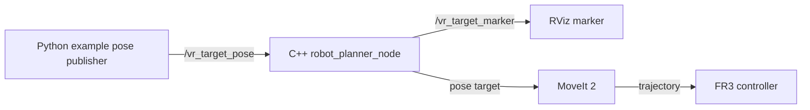

# VR Vision Teleop | Pose-to-Plan Prototype

<p align="center"><strong>ROS 2 Humble · Franka FR3 · MoveIt 2 · Python + C++</strong></p>
<p align="center">A small ROS 2 pipeline that publishes a target pose, visualizes it in RViz, and asks MoveIt to plan and execute an FR3 arm trajectory.</p>

The included Python bridge publishes a fixed example pose at 60 Hz. It provides a test input for the ROS 2 and MoveIt pipeline; a VR device or camera input is not included.

## Signal path



| Component | Source | Behavior |
| --- | --- | --- |
| Pose publisher | [vr_bridge.py](scripts/vr_bridge.py) | Sends a stamped PoseStamped on /vr_target_pose |
| Planner | [robot_planner.cpp](src/robot_planner.cpp) | Publishes a target marker, plans for the fr3_arm group, executes successful plans |
| Launch | [start_planner.launch.py](launch/start_planner.launch.py) | Builds MoveIt parameters and starts the planner node |

## Build and run

This is an ament_cmake package for ROS 2 Humble. It requires a compatible Franka description, the franka_fr3_moveit_config package, MoveIt 2, moveit_configs_utils, geometry_msgs, visualization_msgs, rclcpp, and rclpy in the workspace. The launch file uses the external franka_fr3_moveit_config package and its controller YAML.

```bash
mkdir -p ~/fr3_ws/src
cd ~/fr3_ws/src
git clone https://github.com/fjc6666/vr_vision_teleop.git
cd ~/fr3_ws
source /opt/ros/humble/setup.bash
rosdep install --from-paths src --ignore-src -r -y
colcon build --packages-select vr_vision_teleop
source install/setup.bash
```

Start a compatible FR3 MoveIt demo and controller in one terminal. In two more sourced terminals:

```bash
ros2 launch vr_vision_teleop start_planner.launch.py
ros2 run vr_vision_teleop vr_bridge.py
```

Observe /vr_target_pose and /vr_target_marker in RViz or with ros2 topic echo. Test in simulation first: the planner can execute a trajectory when it finds a solution.

## Integration notes

- The publisher labels its pose in the world frame, while the planner passes pose data to MoveIt using the base reference frame. A real input source needs an explicit TF transform before execution.
- The bridge publishes at 60 Hz, but planning and execution block the callback. Input rate is therefore not the robot control rate.
- The package builds with ROS 2 Humble and starts the planner node when the Franka MoveIt dependencies are available.

## 中文简介

这是一个 FR3 位姿指令到 MoveIt 轨迹执行的 ROS 2 原型：Python 节点发布示例目标，C++ 节点在 RViz 中显示目标，并调用 MoveIt 规划和执行。当前输入源是固定示例位姿；接入真实 VR 手柄或视觉输入时，需要处理坐标系变换与指令频率。
